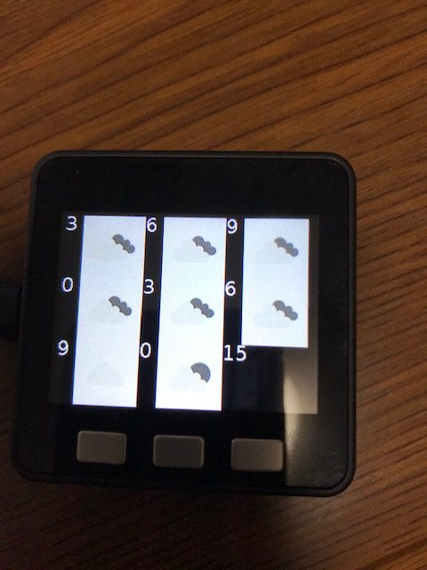
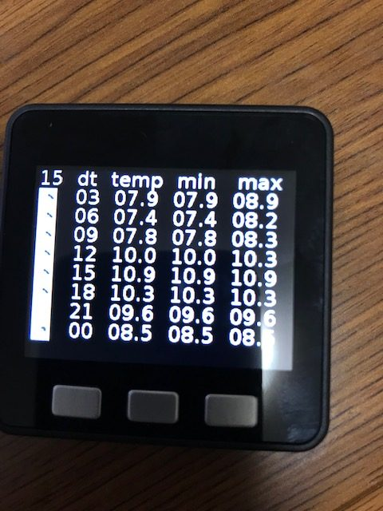

# WeatherStation

お天気情報をm5stackに表示するプロジェクトです。

[つくたのブログ](https://tukutano.com/weatherstation/)

# 環境構築手順

サンプルプログラムを使うためには以下の手順を行う必要があります。

- openweathermapのアカウント取得する
- m5stackのOS（UIFLOW）の導入
- m5stackにプログラムを転送する
- SDカードに画像を保存してm5stackに差し込む
- m5stackのボタンを押して天気予報を表示する

# WeatherStaion.pyの変更

以下の部分を変更します。

g_api_key   = "input your key"# Global input your api key
g_city_code = 0 # Global input your city code

